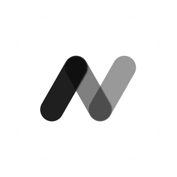

<p align="center">
  
</p>

<h1 align="center">Nook</h1>

A personal, local-first **"kintone you build with Claude."** Ask Claude Desktop to
build small apps (task tracker, reading log, habit tracker…), and use them in a
native desktop app. Your data stays in a single SQLite file on your machine.

- **Declarative, not code-gen.** An app is a JSON definition (fields + views). A
  generic engine renders it — so what Claude authors is safe, inspectable, and
  reversible.
- **Local-first.** Data lives in `~/Library/Application Support/com.nook.app/nook.db`.
  (Claude runs in the cloud, so only the schema + the records relevant to a request
  are ever sent to it — never the whole database.)
- **Built on** Tauri (Rust) + React + [`@emobi/ui`](../Downloads/twent-ui) design system.

## Download

### [⬇️ Download Nook for macOS (Apple Silicon)](https://github.com/hibiki1213/nook/releases/download/v0.3.0/Nook_0.3.0_aarch64.dmg)

`.dmg` · ~16 MB · requires **Apple Silicon** (M1 or later)

Open the `.dmg` and drag **Nook** into your **Applications** folder. The Claude Desktop
extension is bundled inside the app — connect it with one click from the sidebar
(see [Connect Claude Desktop](#connect-claude-desktop)).

#### First launch (unsigned build)

Because this build isn't notarized, macOS blocks it the first time you open it
(*"Nook can't be opened because Apple cannot check it for malicious software."*).
Do this **once**:

- **Easiest — all macOS:** run `xattr -cr /Applications/Nook.app` in Terminal, then open the app normally.
- **GUI — macOS Sequoia (15) / Tahoe (26):** try to open the app, dismiss the warning, then go to **System Settings → Privacy & Security →** scroll down **→ "Open Anyway."**

> ⚠️ The old **right-click → Open** shortcut no longer works on macOS Sequoia and later.

**日本語 — 未署名アプリの初回起動**

このアプリは未署名のため、初回だけ macOS にブロックされます（「"Nook"は壊れているため開けません」「開発元を確認できないため開けません」等）。初回のみ、次のどちらかを実行してください:

- **かんたん（全 macOS 共通）:** ターミナルで `xattr -cr /Applications/Nook.app` を実行 → 通常どおり開く
- **GUI（macOS Sequoia / Tahoe）:** 一度アプリを開いて警告を閉じ、**システム設定 → プライバシーとセキュリティ →** 下までスクロール **→「このまま開く」** をクリック
- ※ 旧来の「右クリック→開く」は macOS Sequoia 以降では使えません

## Architecture

The **Nook app owns the database** and is its only writer. It exposes a tiny
localhost API. The MCP server that Claude Desktop launches is a **pure-JS client**
of that API — it holds no database code and no native dependencies, which is what
lets it ship as a one-click `.mcpb` extension.

```
Claude Desktop ──stdio (MCP)──►  mcp-server  (pure JS, no native deps)
                                      │  fetch → http://127.0.0.1:8765
                                      ▼
                               Nook app (Rust)  ★ sole DB owner
                                      │  rusqlite
                                      ▼
                               nook.db (SQLite)  ← JSON `data` + generated columns + indexes
                                      ▲
                                      │  invoke (in-process)
                               src/ (React renderer + @emobi/ui)
```

An app definition is materialized into a per-app table `d_<appId>`: canonical data
in a JSON `data` column, plus a `GENERATED ALWAYS … VIRTUAL` column (indexed on
demand) per field for fast sort/filter. See
[docs/app-definition.md](docs/app-definition.md) for the spec.

> Because the MCP server talks to the app over HTTP, **the Nook app must be running**
> for Claude to build or edit apps. (This is the deliberate trade for a rock-solid,
> native-dependency-free extension. See the design history in the notes below.)

## Prerequisites

- **Rust** (stable) — `curl https://sh.rustup.rs -sSf | sh`
- **Node 20+** and **pnpm**
- macOS (the DB path in `db.rs` assumes macOS; adjust for other OSes)

## Setup

```bash
# 1. Design system (consumed as a local file: dependency)
cd ../Downloads/twent-ui && pnpm install && pnpm build

# 2. Desktop app
cd -                       # back to this repo
pnpm install

# 3. MCP server (pure JS — bundles to a single self-contained file)
cd mcp-server && pnpm install && pnpm build && cd ..
```

## Run the app

```bash
pnpm tauri dev
```

On first launch it seeds a **タスク管理** (task management) sample app. The local API
comes up on `http://127.0.0.1:8765` (logged to stderr). Apps and records that Claude
creates over MCP appear in the UI automatically (it polls every few seconds).

## Connect Claude Desktop

### Option A — from inside the app (recommended)

Launch **Nook**, then click **「Claude Desktop に接続」** in the sidebar.

The `.mcpb` extension ships **inside the app bundle**, so the app hands it straight to
Claude Desktop, which shows its own **Install** dialog. Restart Claude Desktop and
you're done — nothing to build, and no Node needed (Claude Desktop runs the extension
with its **built-in Node**).

> The extension version is kept in lockstep with the app version. The two talk to each
> other over the localhost API, so they must not drift — shipping the extension inside
> the app is what guarantees that. (Extensions were formerly called DXT; the format is
> now `.mcpb`.)

To rebuild the bundle by hand while developing:

```bash
pnpm build:mcpb   # → mcp-server/nook.mcpb (also run automatically by tauri dev/build)
```

### Option B — manual config (dev)

Point Claude Desktop's config at the bundled entry point:

`~/Library/Application Support/Claude/claude_desktop_config.json`

```json
{
  "mcpServers": {
    "nook": {
      "command": "node",
      "args": ["/Users/hibiki_ceo/nook/mcp-server/dist/index.mjs"]
    }
  }
}
```

Restart Claude Desktop. Then say things like:

> 読書記録アプリを作って。タイトル・著者・評価（5段階）・読了フラグ・感想メモのフィールドで。

Claude calls `create_app`, and the app shows up in Nook's sidebar within a few
seconds. Then: *"『SICP』を評価5、読了で追加して"* → `add_record`.

### Tools Claude gets

`list_apps` · `get_app` · `create_app` · `add_field` · `list_records` ·
`add_record` · `update_record` · `delete_record`

## Releasing a new version

One command — the version and a summary are the only variables:

```bash
bash scripts/release.sh 0.4.0 "リリース概要をここに"
```

It bumps every version in lockstep, builds signed, generates the updater
manifest, commits + pushes, creates the GitHub release with all three assets,
and verifies the published URLs. It refuses to run on a dirty tree, off main,
out of sync with origin, or with a used tag.

The manual steps below are kept for reference / debugging.

---

The app self-updates from GitHub Releases (`tauri-plugin-updater`), so a release needs
**three** artifacts, not one.

1. **Bump the version in lockstep** — `package.json`, `src-tauri/Cargo.toml`,
   `src-tauri/tauri.conf.json`, `mcp-server/manifest.json`, `mcp-server/package.json`,
   and `EXT_VERSION` in `mcp-server/src/index.ts`. The MCP extension ships *inside* the
   app, so the two must never drift.

2. **Build, signed.** This signature is the updater's minisign key — it is *not* Apple
   code signing, and proves an update came from you.

   ```bash
   export TAURI_SIGNING_PRIVATE_KEY="$(cat ~/.tauri/nook.key)"
   export TAURI_SIGNING_PRIVATE_KEY_PASSWORD=""
   pnpm tauri build
   ```

   > ⚠️ `TAURI_SIGNING_PRIVATE_KEY_PATH` is **not** honoured by the bundler. Without the
   > key the build still exits 0 but silently produces no `.sig`.

3. **Generate the updater manifest.**

   ```bash
   bash scripts/make-latest-json.sh
   ```

4. **Create the GitHub Release** tagged `v<version>` and attach all three:

   | file | purpose |
   |---|---|
   | `Nook_<version>_aarch64.dmg` | new installs (the Download button above) |
   | `Nook.app.tar.gz` | the updater's payload |
   | `latest.json` | the updater's manifest (`endpoints` points here) |

Existing users then see **「新しいバージョン v… があります」** in the sidebar on next
launch; one click downloads, installs and relaunches.

> 🔑 `~/.tauri/nook.key` is the **private** signing key — never commit it. Lose it and
> existing installs can never be updated again: they verify against the public key baked
> into `tauri.conf.json`.

## Project layout

```
src/                 React renderer — the generic engine (reads definitions, renders views/forms)
  components/         Sidebar, AppView, TableView, BoardView, RecordModal, FieldInput/Value…
src-tauri/src/       Rust backend
  models.rs          the declarative model (Field, View, AppDefinition)
  db.rs              SQLite: table materialization, generated columns, indexes
  repo.rs            all data operations (shared by UI commands + the local API)
  commands.rs        Tauri commands for the in-app UI (thin wrappers over repo)
  http.rs            localhost API (127.0.0.1:8765) the MCP server calls
  seed.rs            first-run task-management app
mcp-server/          Node MCP server Claude Desktop connects to
  src/index.ts       pure-JS tools → fetch the app's local API (no DB code)
  manifest.json      .mcpb extension manifest
docs/app-definition.md   the shared declarative spec
```

## Notes / current limits (MVP)

- Field types: text, textarea, number, checkbox, select, date, url, money
  (currency-formatted number), rating (stars), tags (multi-label), image
  (thumbnail; pick from PC or URL), relation (link to another app's record).
- Views: table (columns + sort), board (group by a select field), calendar (by a
  date field), gallery (image cards), summary (aggregate a number/money field,
  optionally grouped), chart (time-series line/area), and heatmap (GitHub-style
  year grid). No drag-and-drop yet.
- **Single writer:** the Nook app is the only process that opens SQLite, so there's no
  cross-process contention to reason about. The MCP server is a stateless HTTP client.
- **Why this shape?** The MCP extension must be free of native modules
  (`better-sqlite3` crashes inside Claude Desktop's sandboxed runtime — ABI + macOS
  code-signing). Making the app the DB owner and the extension a thin client removes
  the native dependency entirely and keeps a single source of truth.
```
